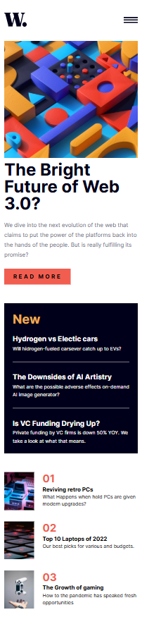
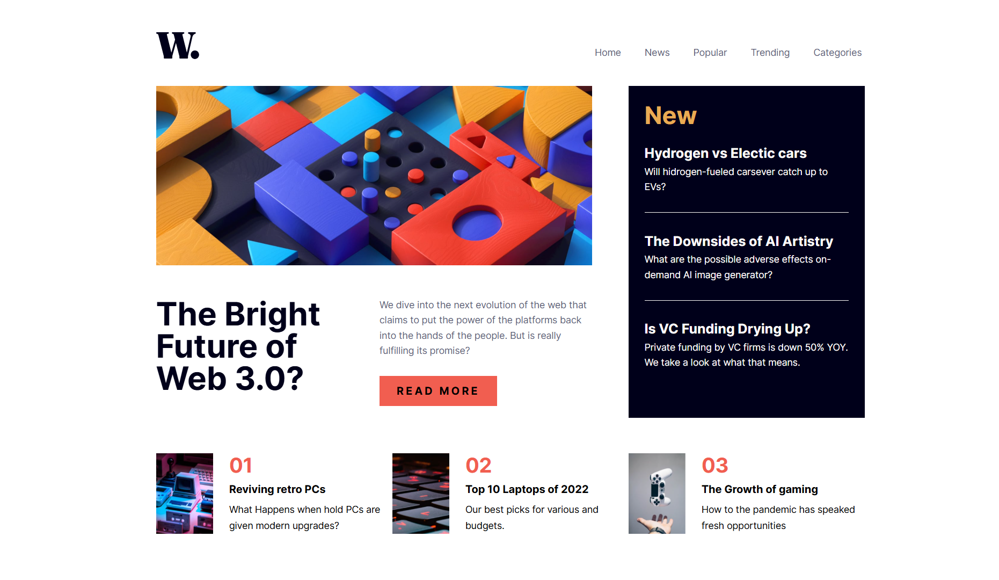
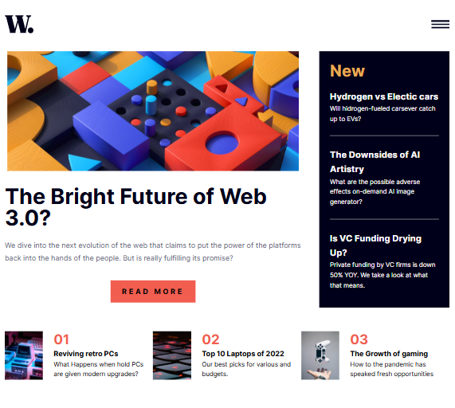

# Frontend Mentor - News homepage solution

Questa è una soluzione al [News homepage challenge on Frontend Mentor](https://www.frontendmentor.io/challenges/news-homepage-H6SWTa1MFl) Le sfide di Frontend Mentor aiutano a migliorare le capacità di codifica costruendo progetti realistici.

## Table of contents

- [Overview](#overview)
  - [The challenge](#the-challenge)
  - [Screenshot](#screenshot)
- [Built with](#built-with)
- [Author](#author)

## Overview

### The challenge

Gli utenti dovrebbero essere in grado di:

- Visualizzare il layout ottimale in base alle dimensioni dello schermo del dispositivo
- Visualizza gli stati di passaggio del mouse e di hover per tutti gli elementi interattivi sulla pagina

### Screenshot

  <figure style="display: flex; flex-direction: column; width: 40%; align-items: center;">
    <figcaption style="text-align: center; background-color: yellow"><strong>Design mobile</strong></figcaption>
    
  </figure>
  

    <figure style="display: flex; flex-direction: column; align-items: center;">
      <figcaption style="text-align: center; margin-bottom: 5rem; background-color: yellow"><strong>Design desktop</strong></figcaption>
      
    </figure>
    <figure style="display: flex; flex-direction: column; align-items: center;">
      <figcaption style="text-align: center; margin-top: 3rem; background-color: yellow"><strong>Design tablet</strong></figcaption>
      
    </figure>
  

## Built with

- Flexbox
- Grid
- React v.19.2.0
- TypeScript v.5.9.3
- Tailwind v.4.1.17
  - Tailwind classes
  - Tailwind custom properties

## Author

- Website - [Sito web dell'autore](https://gabrielnissoria.netlify.app/)
- Frontend Mentor - [@Gabriel299](https://www.frontendmentor.io/profile/Gabriel299)